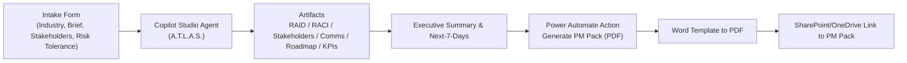

# A.T.L.A.S. Architecture (high level)

**Core:** Microsoft Copilot Studio agent with Instructions enforcing: **industry‑first intake → artifact generation (RAID, RACI, Stakeholder Map, Communications Plan, Phase 0–3 Roadmap, KPIs/OKRs) → executive summary → export**.

**Grounding:** Industry profiles and artifact definitions uploaded as Knowledge for retrieval‑augmented responses.

**Industry Switch:** Global variable **Industry** (**SaaS / Healthcare / FinTech / Energy / Engineering**) selects terminology, risks, KPIs, compliance cues, and typical stakeholders. **RiskTolerance** (Low/Medium/High) adjusts tone and mitigations.

**Export:** A Power Automate flow receives a JSON payload, populates a Word template (content controls), converts to PDF, saves to SharePoint/OneDrive, and returns a link to the **PM Pack**. The payload matches [`/schemas/generate_pm_pack_payload.schema.json`](../schemas/generate_pm_pack_payload.schema.json).

## Diagram

## Repo map (key files)
- **Instructions & Knowledge:** `docs/copilot_instructions.md`, `knowledge/ATLAS_Industry_Profiles_v1.md`, `knowledge/ATLAS_Templates_and_Definitions_v1.md`  
- **Schema:** `schemas/generate_pm_pack_payload.schema.json`  
- **Templates & Flow:** `templates/word_template_mapping.md`, `flows/generate_pm_pack_example.json`  
- **Samples:** `samples/` (brief + CSV tables + executive summary)  

> Draft outputs only—review for policy, legal, and compliance before use.
